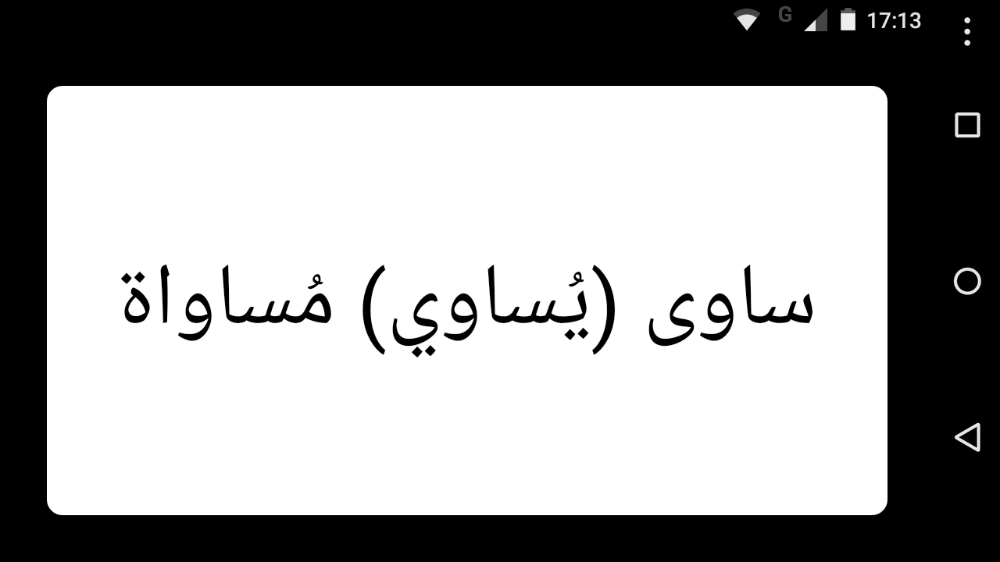

⚠ This application is unmaintained and is left here for historical purposes. Please use [AnkiDroid](https://github.com/ankidroid/Anki-Android) instead. Flashcard sets for use with AnkiDroid can be found here: [flashcard-sets](https://github.com/bmaupin/flashcard-sets)

#### Features

- Clean gesture-based interface
- Support for showing Arabic text on early (pre-4.1) versions of Android (via [Better Arabic Reshaper](https://github.com/agawish/Better-Arabic-Reshaper) and bundled customized Arabic fonts)
- Spaced-repetition algorithm
- Preloaded with vocabulary from Ahlan wa Sahlan, second edition
- Preconfigured study sets based on parts of speech, a specific chapter, or predefined categories
- Colourful summary chart at end of every study session
- Ability to search through all cards
- Option to show or hide vowels
